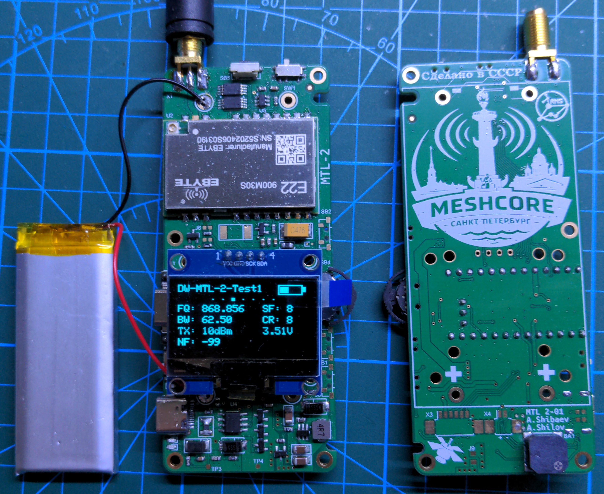

<h1>📡 MTL-2: Portable High-Power LoRa node</h1>
 
  

  
## MTL-2
MTL-2 - Это портативное энергоэкономичное устройство, основанное на модулях Ebyete и ProMicro (NRF52840). Предназначено для работы в MeshCore, Meshtastic, в качестве клиента и ретранслятора.

##  Ключевые особенности
LoRa 30dBm
Oled 1.3'
Buzzer
Switch Buzzer/Led (Quiet mode)
Switch POWER Low/Hight
Vibro-notification
3-position multifuctional switch or 3 button
Connector for GPS-module like VK2828U7G5LF
1A Standalone Linear Li-Ion Battery Charger
Battery protection lithium-ion/polymer battery
Li-Ion cell holder 2x18650 TBH-18650-2A-P (FC1-5212)

Software MTLmicro https://github.com/VladelfPv/MeshCoreMTL.git
