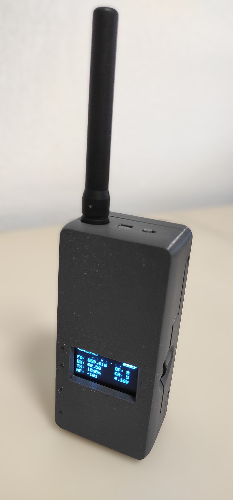
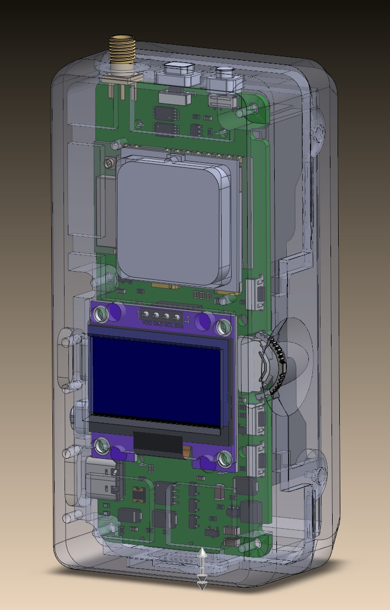
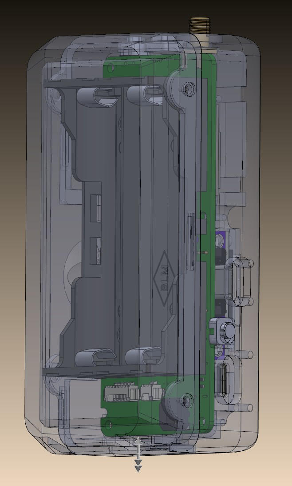
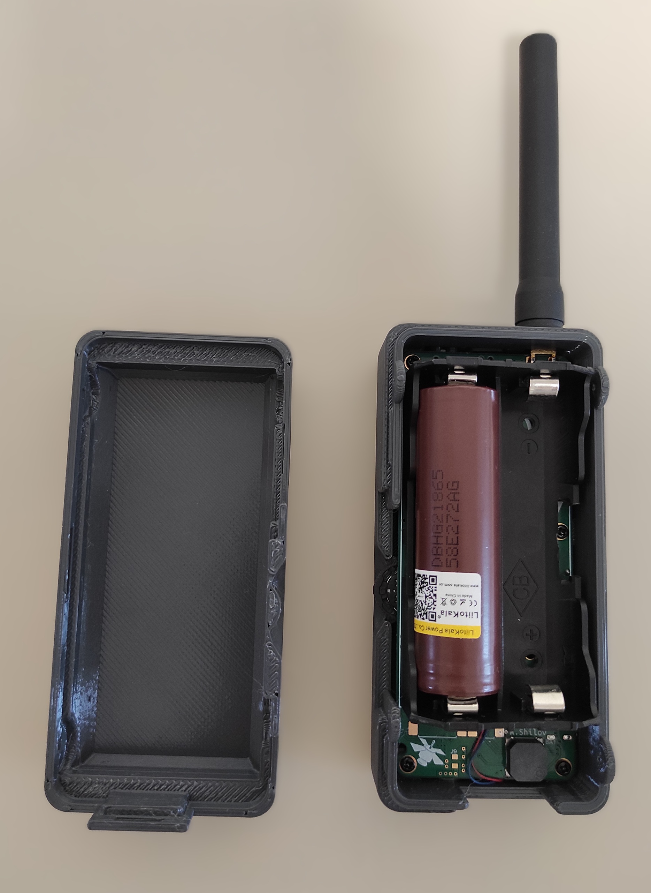

<h1>📡 MTL-2: Portable High-Power LoRa node</h1>
  

  
  ## MTL-2
MTL-2 - Это портативное энергоэкономичное устройство, основанное на модулях Ebyete и ProMicro (NRF52840). Предназначено для работы в MeshCore, Meshtastic, в качестве клиента и ретранслятора.

 
  
##  Ключевые особенности
* LoRa 30-31dBm
* Oled 1.3'
* Buzzer
* Switch Buzzer/Led (Quiet mode)
* Switch POWER set Low/Hight (20dBm/30dBm)
* Vibro-notification
* 3-position multifuctional switch or 3 button
* Connector for GPS-module like VK2828U7G5LF
* 1A Standalone Linear Li-Ion Battery Charger
* Battery protection lithium-ion/polymer battery
* Li-Ion cell holder 2x18650 TBH-18650-2A-P (FC1-5212)

##  Software MeshCore
The software was developed by [VladelfPv](https://github.com/VladelfPv)  [MTLmicro](https://github.com/VladelfPv/MeshCoreMTL.git) 

##  Software Meshtastic
Use the J9 jumper for compatibility with FakeTec. In this case, DC-DC Up remains constantly on, which will increase battery consumption to 10mA.
As a jumper, you can use the chip ferrite beads like BLM21PG221SN1D, BLM21PG121SH1D etc 
Оther settings are configured in the Meshtastic software.

 
 

