

<h1>📡 MTL-2: Portable High-Power LoRa node</h1>
  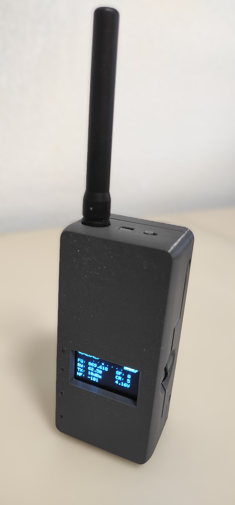 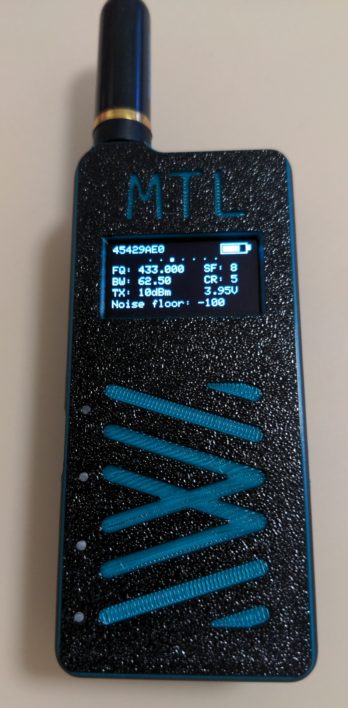

  
  ## MTL-2
MTL-2 - Это портативное энергоэкономичное устройство, основанное на модулях [Ebyete](https://www.ebyte.com/) и ProMicro (NRF52840). Предназначено для работы в [MeshCore](https://github.com/meshcore-dev), [Meshtastic](https://github.com/meshtastic), в качестве клиента и ретранслятора.

 
  
##  Ключевые особенности
* LoRa 30-31dBm
* Oled 1.3'
* Buzzer
* Switch Buzzer/Led (Quiet mode)
* Switch POWER set Low/Hight (20dBm/30dBm)
* Vibro-notification
* 3-position multifuctional switch or 3 button
* Connector for GPS-module like VK2828U7G5LF
* 1A Standalone Linear Li-Ion Battery Charger
* Battery protection lithium-ion/polymer battery
* Li-Ion cell holder 2x18650 TBH-18650-2A-P (FC1-5212)

##  Органы управления
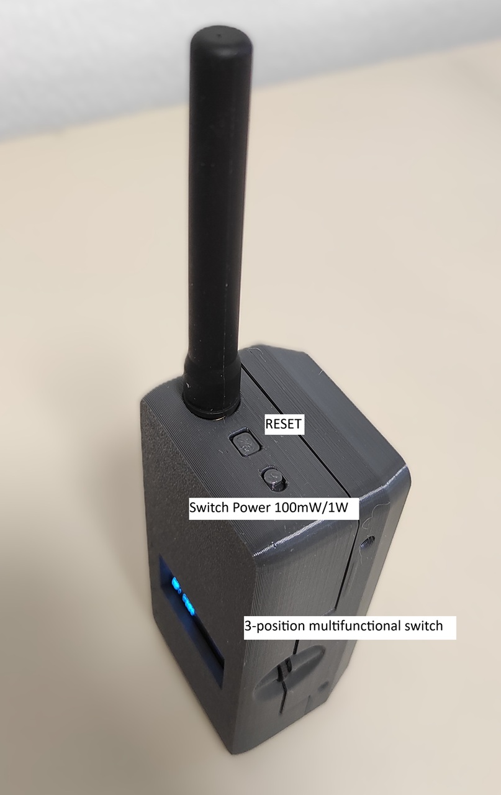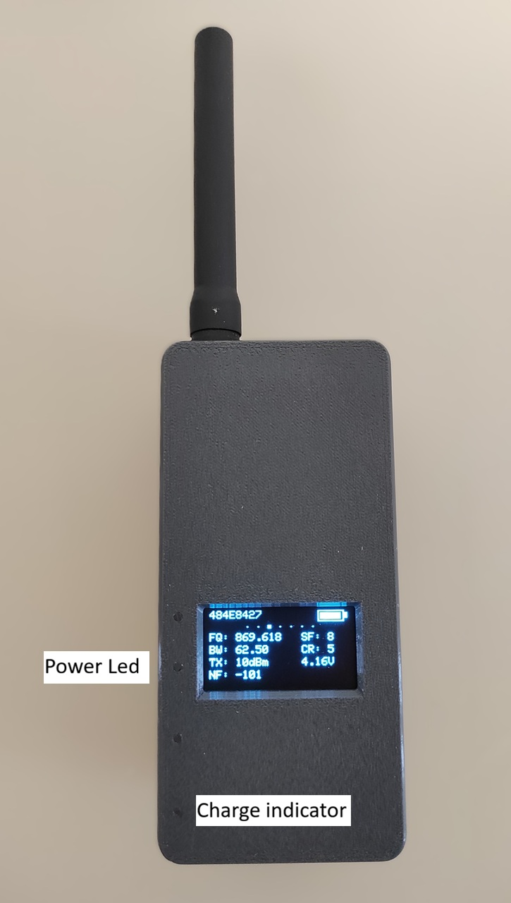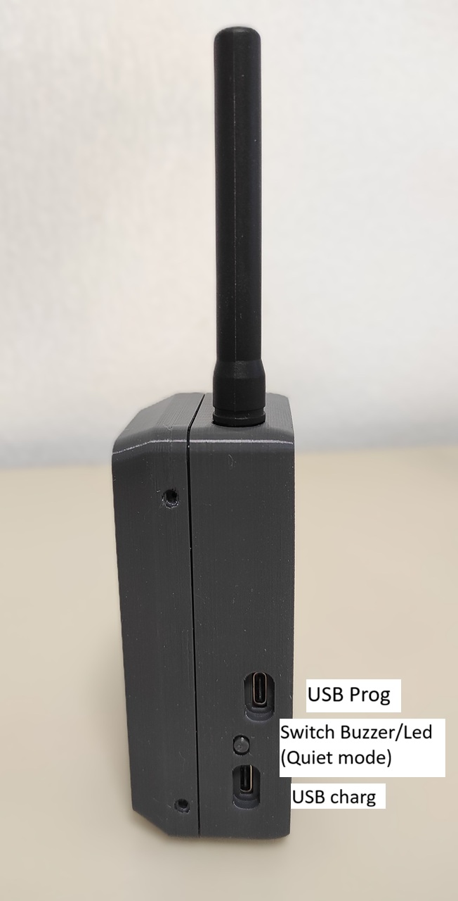

##  Software MeshCore
The software was developed by [VladelfPv](https://github.com/VladelfPv)  [MTLmicro](https://github.com/VladelfPv/MeshCoreMTL.git) 

##  Software Meshtastic
Use the J9 jumper for compatibility with FakeTec. In this case, DC-DC Up remains constantly on, which will increase battery consumption to 10mA.

As a jumper, you can use the chip ferrite beads like BLM21PG221SN1D, BLM21PG121SH1D etc 
Оther settings are configured in the Meshtastic software.

GPIO: 
- 6-Buzzer.
- 8-Vibro.

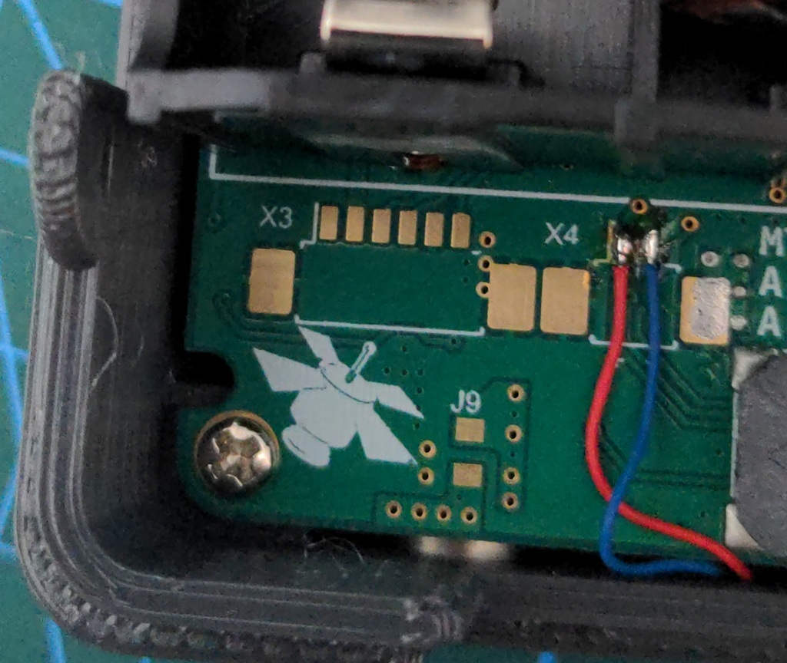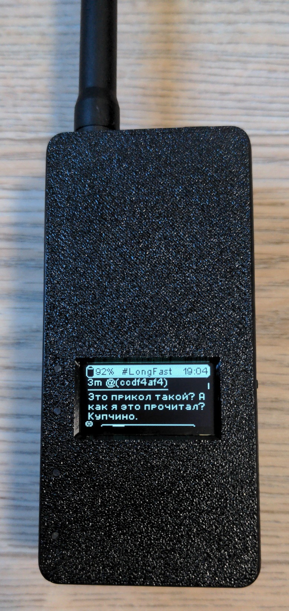

##  Update Software 
To update the Software, click the RESET button twice. In the window that opens, copy the firmware file xxxxx.uf2

### Frequency range
#### 150-170Mhz
- e22-170m30s    SX1268  30dBm

#### 430Mhz
- e22p-433m30s   SX1268          30dBm
- e22-400m30s    SX1262, SX1268  30dBm 
- e22-400m33s    SX1268          33dBm

#### 868-915Mhz
- e22p-868m30s   SX1262  31dBm
- e22p-915m30s   SX1262  31dBm 
- e22-900m30s    SX1262  30dBm
- e22-900m33s    SX1262  33dBm

##  Files
*[Gerber and Pick Place](/01-PCB/Fabrication)

*Shematic and documentation for [E22](/01-PCB/e22-C)

*Shematic and documentation for [E22p](/01-PCB/e22p-C)

*[IO spreadsheet](/01-PCB/MTL-2_IO.xlsx)

*3d model PCB [step](/04-3dmod)

*3d print model [Case](/05-case)

##  ⚠️Special attention
 Replace the capacitor C6 with a jumper!

##  Additional images

 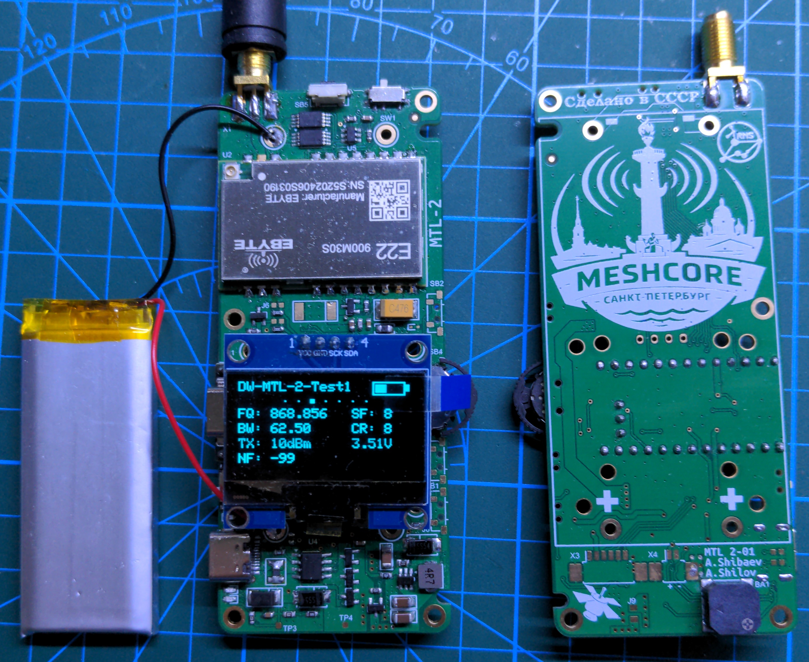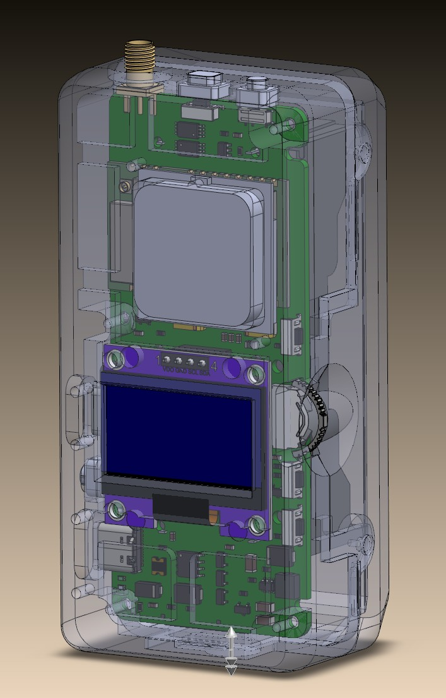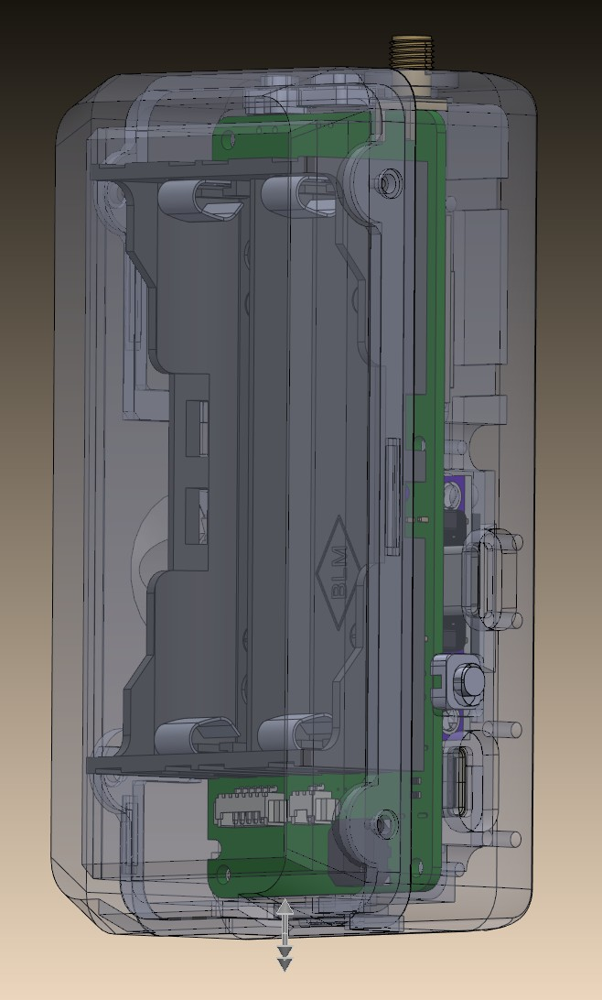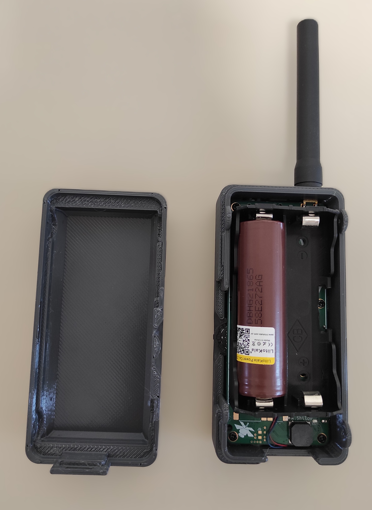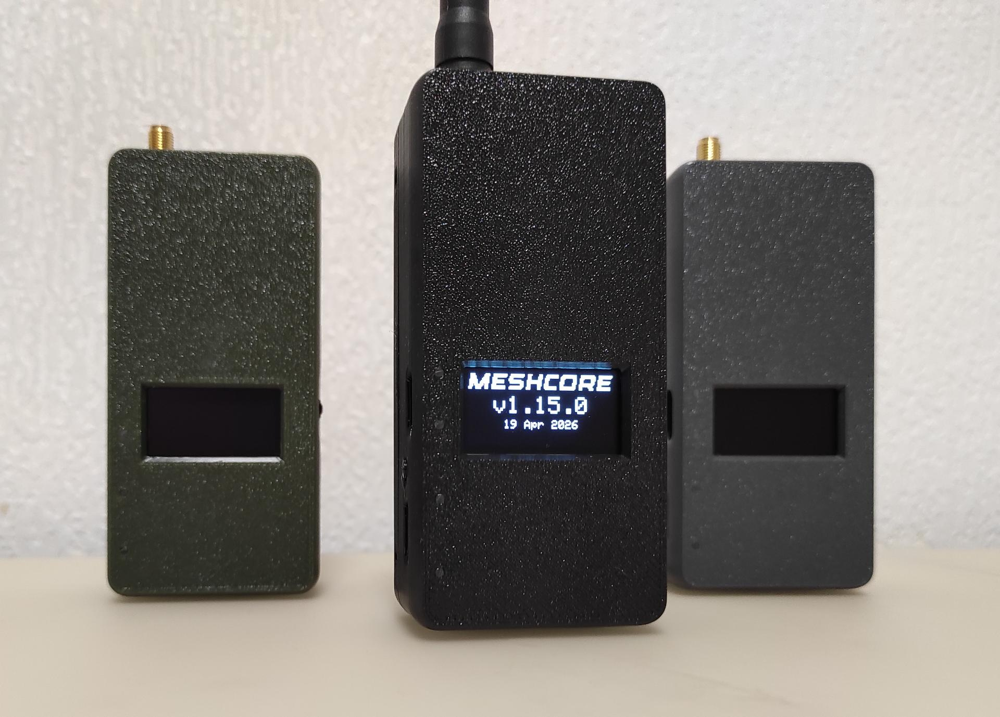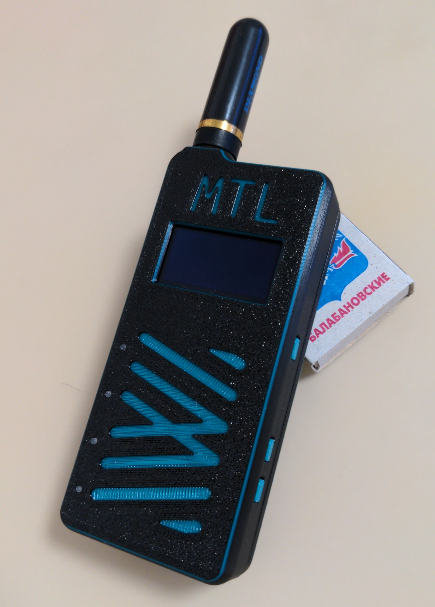
 

